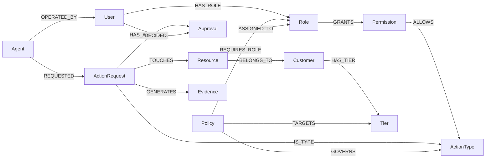

# Veridex

> **Every decision has a reason.**

Veridex is a graph-native authorization workspace for automated actions. It resolves a deterministic authorization verdict from connected identity, permission, resource, customer, tier, policy, approval, and evidence context. The product supports the end-to-end workflow **Evaluate → Explain → Approve → Audit** and returns exactly one of `ALLOWED`, `BLOCKED`, or `APPROVAL_REQUIRED`.

Authorization is deliberately **not** AI-driven. No LLM participates in policy evaluation, policy precedence, approval eligibility, or state transitions. Any future explanation enhancement must describe an already determined decision; the current explanation is generated directly from the graph-derived relationship path.

## Live demo

**<https://veridex-shaiksohelll.onrender.com>**

| Probe | Purpose |
|---|---|
| `GET /healthz` | Liveness. Returns `200 {"status":"ok"}` without contacting CognoDB. |
| `GET /readyz` | Readiness. Verifies CognoDB connectivity and returns `200 {"status":"ready"}` or the non-sensitive `503 {"status":"unavailable"}`. |

The demo runs on a Render free instance, so it sleeps when idle. The first request after a period of inactivity can take up to roughly a minute while the container cold-starts. Requesting `/healthz` first is the cheapest way to wake it before a walkthrough.

## Product behavior

The interface is a restrained technical workspace intended to make a decision understandable immediately. A user submits one demo agent, action type, resource, and amount. The server creates an `ActionRequest`, derives customer context from the graph, evaluates policy facts in pure TypeScript, persists append-only decision evidence, and returns the verdict plus the actual relationships used.

For an approval-required result, Veridex creates a `PENDING` approval in the same graph write transaction as decision evidence. An eligible active demo user can approve or reject it. The first terminal decision wins, a duplicate attempt returns a safe conflict, and a distinct immutable evidence record is appended for the terminal event.

| Capability | Implemented behavior |
|---|---|
| Evaluate | Creates a one-resource `ActionRequest`, derives graph facts, and returns a deterministic verdict. |
| Explain | Shows actual typed relationship segments, not a decorative graph visualisation. |
| Approve | Creates and resolves a role-assigned approval with first-terminal-decision-wins semantics. |
| Audit | Displays persisted append-only decision and approval evidence records. |
| History | Lists past decisions newest-first through an opaque keyset cursor, and loads the explanation, approvals, and immutable evidence for any selected request. |
| Safety | Validates input, parameterizes all runtime Cypher values, hides raw database/schema details, and uses demo-only identities. |

## Why CognoDB

The decision depends on a real multi-hop relationship chain rather than on isolated fields. An agent is authorized through its operator, roles, permissions, and action type. The action's resource supplies customer and tier context, which selects policies, which may in turn require a role and eligible approvers. CognoDB keeps these traversals close to the domain and makes the path available for explanation.



The four graph paths used by the decision workflow:

```text
Agent → User → Role → Permission → ActionType
Agent → ActionRequest → Resource → Customer → Tier
Policy → ActionType and Tier → optional required Role → eligible Users
ActionRequest → Approval / Evidence   (persistence / retrieval — not a verdict input)
```

A relational schema could answer these with joins. The reason a graph earns its place here is that the **explanation is the product**: the same traversal that decides the verdict is the artifact shown to the user and frozen into evidence. There is no second query, and no risk of the explanation drifting from the decision.

## Architecture

The repository intentionally uses the existing full-stack scaffold rather than a framework migration: **React 19 + Vite**, **Express**, **tRPC**, **TypeScript strict mode**, **Tailwind 4**, and **Vitest**. It is a single Node process that is appropriate for managed autoscaling and requires no worker or queue.

| Layer | Responsibility |
|---|---|
| `client/src/pages/Home.tsx` | Tactile evaluate, explain, approval, evidence, and decision-history workflow. The client displays server output only; it makes no authorization decision. |
| `server/routers/veridex.ts` | Public, schema-validated tRPC boundary for metadata, evaluation, explanation, approval queue, approval decision, evidence retrieval, and request listing. |
| `server/graph/repository.ts` | Server-only parameterized reads that normalize authorization, context, policy, approver, and request-history facts from CognoDB. |
| `server/decision/evaluator.ts` | Pure deterministic evaluator. It has no database, HTTP, or UI dependency. |
| `server/graph/requests.ts` | Transactional `ActionRequest` creation, fact loading, evaluation, and decision-evidence persistence. |
| `server/graph/governance.ts` | Transactional approval creation/resolution and append-only evidence persistence. |
| `server/cognodb/*` | Server-only validated configuration and the official Neo4j-compatible JavaScript driver boundary. |
| `server/graph/schema.ts`, `server/graph/seed.ts` | Static repeatable schema/index definitions and idempotent demo data. |
| `.github/workflows/quality.yml` | GitHub Actions gate for install, lint, type-check, tests, and production build. |

The application connects to CognoDB only through the official `neo4j-driver` package. It uses a lazily created, process-local driver with per-operation sessions and explicit transaction functions. The driver package is never imported into browser code.

## Frozen graph model

The graph contains exactly **12 node labels** and **16 meaningful relationship types**. Every relationship supports a concrete product decision, explanation, eligibility, or audit requirement.

| Node labels | Product purpose |
|---|---|
| `Agent`, `User`, `Role`, `Permission` | Represent operating identity and action-specific authorization. |
| `ActionType`, `ActionRequest` | Distinguish a governed action definition from a persisted evaluation instance. |
| `Resource`, `Customer`, `Tier` | Supply server-derived ownership and customer criticality context. |
| `Policy` | Defines ordered `ALLOW`, `BLOCK`, or `REQUIRE_APPROVAL` behavior. |
| `Approval`, `Evidence` | Record race-safe human resolution and immutable auditable events. |

| Relationship type | Source → target | Product purpose |
|---|---|---|
| `OPERATED_BY` | `Agent → User` | Identifies the user responsible for the agent. |
| `HAS_ROLE` | `User → Role` | Resolves authorization and approval eligibility. |
| `GRANTS` | `Role → Permission` | Grants an action-specific permission. |
| `ALLOWS` | `Permission → ActionType` | Maps permission to governed action capability. |
| `REQUESTED` | `Agent → ActionRequest` | Attributes a persisted evaluation to an agent. |
| `IS_TYPE` | `ActionRequest → ActionType` | Identifies the requested action class. |
| `TOUCHES` | `ActionRequest → Resource` | Enforces the MVP's exactly-one-resource domain boundary. |
| `BELONGS_TO` | `Resource → Customer` | Derives ownership rather than trusting caller input. |
| `HAS_TIER` | `Customer → Tier` | Supplies tier context for policy applicability. |
| `GOVERNS` | `Policy → ActionType` | Makes a policy applicable to an action class. |
| `TARGETS` | `Policy → Tier` | Makes a policy applicable to a customer tier. |
| `REQUIRES_ROLE` | `Policy → Role` | Assigns the approver role for approval-required policies. |
| `HAS_APPROVAL` | `ActionRequest → Approval` | Connects a request to its pending or terminal approval. |
| `ASSIGNED_TO` | `Approval → Role` | Preserves the role required to decide the approval. |
| `DECIDED` | `User → Approval` | Attributes the first terminal decision to an eligible active user. |
| `GENERATES` | `ActionRequest → Evidence` | Connects immutable decision and approval event records to the request. |

Stable IDs are unique for all 12 node labels. The schema also applies targeted lookup indexes for action-request scenario lookup, policy effect, approval status, and evidence event type. Schema labels, relationship names, constraints, and indexes are static code constants; they are never built from a caller-supplied string.

## Deterministic decision contract

The graph repository returns facts. The pure evaluator applies the rules in this order and emits stable reason codes, a selected policy when applicable, eligible approvers, a relationship-path snapshot, and an immutable evidence snapshot.

1. Validate that the request has exactly one resource and a finite positive amount.
2. Require that the agent exists and is active.
3. Require a complete authorization path: `Agent → User → Role → Permission → ActionType`.
4. Require the action request and resource context to exist.
5. Require the resource's customer and tier context, and require the customer to be verified.
6. Select applicable active policies that govern the action type, target the tier, and include the amount using inclusive optional bounds.
7. If no policy is applicable, return `BLOCKED / NO_APPLICABLE_POLICY`.
8. Apply precedence: `BLOCK` > `REQUIRE_APPROVAL` > `ALLOW`. Within the winning effect, lower numeric priority wins; then lexicographically lower policy ID wins.
9. For `REQUIRE_APPROVAL`, resolve the required role and at least one eligible active user. Otherwise return `BLOCKED / MISSING_APPROVER`.
10. Return `ALLOWED`, `BLOCKED`, or `APPROVAL_REQUIRED` and persist the decision evidence snapshot.

| Contract | Rule |
|---|---|
| Missing policy | `BLOCKED / NO_APPLICABLE_POLICY` (default deny). |
| Explicit allow | `ALLOWED` requires an applicable `ALLOW` policy. |
| Policy bounds | `minAmount` and `maxAmount` are optional and inclusive. |
| Resource scope | Exactly one `TOUCHES` relationship per evaluated request. Zero and multiple resources are distinct domain failures. |
| Approval transition | `PENDING → APPROVED` or `PENDING → REJECTED` once only; first terminal decision wins. |
| Evidence | Create-only `Evidence` nodes; current policy edits cannot alter saved decision snapshots. |

## Seeded demo scenarios

The seed script is idempotent: rerunning it merges the fixed current-policy graph and ensures all historical demonstration relationships exist. IDs are stable and all identities are explicitly demo-only.

| Scenario | Expected verdict | Representative reason |
|---|---|---|
| `ALLOWED` | `ALLOWED` | An enterprise refund below the approval range matches an explicit allow policy. |
| `BLOCKED_POLICY` | `BLOCKED` | A higher-precedence large-refund block applies. |
| `APPROVAL_REQUIRED` | `APPROVAL_REQUIRED` | An enterprise refund within the approval range resolves the finance-manager approver. |
| `UNAUTHORIZED_AGENT` | `BLOCKED` | The active agent has no complete permission path for the action. |
| `UNVERIFIED_CUSTOMER` | `BLOCKED` | The resource belongs to an unverified customer. |
| `MISSING_APPROVER` | `BLOCKED` | The approval policy applies but no eligible active user has its required role. |
| `NO_APPLICABLE_POLICY` | `BLOCKED` | No policy applies, so default-deny is enforced. |

## Setup

Use Node.js 22 and pnpm 10. The repository lockfile is authoritative.

```bash
pnpm install --frozen-lockfile
pnpm graph:verify
pnpm dev
```

The commands below are intentionally split so the schema, data, and verification sequence is explicit.

| Command | Purpose |
|---|---|
| `pnpm graph:schema` | Checks CognoDB connectivity and applies repeatable constraints/indexes. |
| `pnpm graph:seed` | Checks connectivity and writes the idempotent demo graph. |
| `pnpm graph:verify` | Applies schema, seeds twice, checks semantic graph coverage, and evaluates all seven required scenarios. |
| `pnpm lint` | Runs ESLint with zero warnings permitted. |
| `pnpm check` | Runs TypeScript strict mode without emitting files. |
| `pnpm test` | Runs Vitest unit, router, and credential-gated live graph integration tests. |
| `pnpm test:e2e` | Runs the Playwright journey when `VERIDEX_E2E_BASE_URL` points to a seeded server. |
| `pnpm build` | Produces the Vite client and bundled Node server production build. |

`pnpm graph:verify` is the canonical pre-demo command. It applies the schema, seeds, and then proves all seven scenarios resolve correctly, so it both repairs and verifies the demo graph in one step.

## Environment variables

All values are server-side secrets. Do not commit a real `.env` file or expose a `COGNODB_*` value through `VITE_*` variables. The managed project secret facility is the intended configuration path.

| Variable | Required | Purpose |
|---|---:|---|
| `COGNODB_URI` | Yes | CognoDB Neo4j-compatible Bolt URI. |
| `COGNODB_USERNAME` | Yes | CognoDB database username. |
| `COGNODB_PASSWORD` | Yes | CognoDB database password. |
| `VERIDEX_E2E_BASE_URL` | Only for E2E | Base URL of a running, seeded Veridex server for browser tests. |

`COGNODB_DATABASE` is intentionally not part of Veridex’s required Bolt contract. Every application, schema, seed, and verification session calls `driver.session()` with no database option, so CognoDB/the driver selects the provider default. The application never guesses or hard-codes a database name.

The `.gitignore` excludes `.env` and `.env.*`. The required variable contract is documented here because the managed project environment restricts direct creation of environment files; any `.env.example` outside that environment must contain placeholders only.

## Core Cypher operations

All runtime values are passed as Cypher parameters. Labels, relationship types, and property names are static code constants.

| Operation | Static Cypher responsibility | Source |
|---|---|---|
| Authorization facts | Traverse `Agent → User → Role → Permission → ActionType` for a fixed request ID. | `server/graph/repository.ts` |
| Resource context | Traverse `ActionRequest → Resource → Customer → Tier`; return no caller-supplied customer claim. | `server/graph/repository.ts` |
| Policy facts | Match active policies through `GOVERNS` and `TARGETS`, preserving effect, priority, bounds, and optional role. | `server/graph/repository.ts` |
| Request history | Page `ActionRequest` rows ordered by `createdAt` then `actionRequestId`, filtered by a validated opaque keyset cursor and bounded by an integer `LIMIT`. | `server/graph/repository.ts` |
| Request creation | `CREATE` the action request and its one `TOUCHES` relationship inside a write transaction. | `server/graph/requests.ts` |
| Approval creation | Create `Approval`, `HAS_APPROVAL`, `ASSIGNED_TO`, and `DECISION_EVALUATED` evidence atomically. | `server/graph/governance.ts` |
| Approval resolution | `MATCH` a `PENDING` approval and eligible active user, conditionally create `DECIDED`, set terminal fields once, and append evidence in one transaction. | `server/graph/governance.ts` |

### The four queries that carry the contract

The queries below are quoted from source and reformatted onto multiple lines for readability; the modules store each as a single-line string. Property lists are elided with `...` where they are long and uninteresting.

#### 1. Request creation — the invariant is structural, not defensive

```cypher
MATCH (agent:Agent {agentId: $agentId})
MATCH (actionType:ActionType {actionTypeId: $actionTypeId})
MATCH (resource:Resource {resourceId: $resourceId})
CREATE (request:ActionRequest {
  actionRequestId: $actionRequestId,
  amount: $amount,
  createdAt: $createdAt,
  status: 'EVALUATED'
})
CREATE (agent)-[:REQUESTED]->(request)
CREATE (request)-[:IS_TYPE]->(actionType)
CREATE (request)-[:TOUCHES]->(resource)
RETURN { ... } AS actionRequest
```

Three **required** `MATCH` clauses precede every `CREATE`. If the agent, action type, or resource does not exist, the pattern produces no rows and the query writes *nothing* — no half-linked request, no orphan to clean up afterwards. The exactly-one-`TOUCHES` rule is therefore a property of the write's shape rather than an application check that a future caller could bypass. It runs inside `executeWrite`, so all four creates commit or none do. The integration test `creates no orphaned ActionRequest when the resource does not exist` covers this path.

#### 2. Approval resolution — eligibility and the single terminal decision

```cypher
MATCH (request:ActionRequest)-[:HAS_APPROVAL]->(approval:Approval {approvalId: $approvalId})
      -[:ASSIGNED_TO]->(role:Role)
MATCH (decider:User {userId: $deciderUserId, active: true})-[:HAS_ROLE]->(role)
WITH request, approval, role, decider
WHERE approval.status = 'PENDING'
SET approval.status = $outcome,
    approval.decidedAt = $decidedAt
CREATE (decider)-[:DECIDED]->(approval)
CREATE (evidence:Evidence { ..., eventType: 'APPROVAL_DECIDED', ... })
CREATE (request)-[:GENERATES]->(evidence)
RETURN ...
```

This one query enforces both governance rules through traversal instead of code:

- **Eligibility.** The second `MATCH` binds `role` to the *same node* the approval is `ASSIGNED_TO`. A user can only decide an approval if they hold precisely that role and are `active`. There is no separate permission table to fall out of sync with the assignment.
- **First terminal decision wins.** `WHERE approval.status = 'PENDING'` sits between the match and the `SET`, making the update a compare-and-set on the approval node. Two concurrent decisions contend for the same node; the loser finds a non-`PENDING` status, matches nothing, and writes nothing.

Zero returned rows is deliberately ambiguous — already decided, or not eligible — so the caller disambiguates afterwards into `ApprovalConflictError` versus `ApprovalEligibilityError`, and neither leaks graph structure to the client. The integration test `allows only one concurrent terminal decision for a pending approval` exercises the race directly.

#### 3. Decision evidence — conditional write in a single transaction

```cypher
MATCH (request:ActionRequest {actionRequestId: $actionRequestId})
OPTIONAL MATCH (requiredRole:Role {roleId: $requiredRoleId})
WITH request, requiredRole
CREATE (evidence:Evidence {
  ...,
  eventType: 'DECISION_EVALUATED',
  explanationSnapshotJson: $explanationSnapshotJson,
  ...
})
CREATE (request)-[:GENERATES]->(evidence)
FOREACH (_ IN CASE WHEN $requiresApproval AND requiredRole IS NOT NULL THEN [1] ELSE [] END |
  CREATE (approval:Approval { ..., status: 'PENDING' })
  CREATE (request)-[:HAS_APPROVAL]->(approval)
  CREATE (approval)-[:ASSIGNED_TO]->(requiredRole)
)
RETURN ...
```

Cypher has no `IF`, so `FOREACH` over a list produced by `CASE` is the idiomatic conditional write: the body runs exactly once when an approval is required and zero times otherwise. The consequence that matters is atomicity — there is no window in which a recorded `APPROVAL_REQUIRED` decision exists without its pending approval, or vice versa.

The versioned explanation snapshot is serialized into the evidence node **at write time**. That is what makes the audit trail truthful: a later policy edit changes future decisions but cannot retroactively alter what a past decision recorded, because audit reads deserialize the stored artifact rather than replaying the current graph. `Evidence` is only ever `CREATE`d — no code path issues `SET` or `DELETE` against it.

#### 4. History paging — keyset, not `SKIP`/`OFFSET`

```cypher
MATCH (agent:Agent)-[:REQUESTED]->(request:ActionRequest)-[:IS_TYPE]->(actionType:ActionType)
OPTIONAL MATCH (request)-[:TOUCHES]->(resource:Resource)-[:BELONGS_TO]->(customer:Customer)
OPTIONAL MATCH (request)-[:HAS_APPROVAL]->(approval:Approval)
CALL {
  WITH request
  OPTIONAL MATCH (request)-[:GENERATES]->(ev:Evidence)
  RETURN ev ORDER BY ev.createdAt DESC, ev.evidenceId DESC LIMIT 1
}
WITH ...
WHERE $cursorCreatedAt IS NULL
   OR request.createdAt < $cursorCreatedAt
   OR (request.createdAt = $cursorCreatedAt AND request.actionRequestId < $cursorId)
RETURN ...
ORDER BY request.createdAt DESC, request.actionRequestId DESC
LIMIT toInteger($fetchLimit)
```

Four decisions are worth calling out:

- **The compound predicate is a keyset (seek) cursor.** Unlike `SKIP`, its cost does not grow with page depth, and rows written during paging cannot shift a page boundary and produce a duplicate or a gap.
- **`createdAt` is not unique.** The seed deliberately writes eight requests with an identical timestamp. `actionRequestId` therefore acts as the tiebreaker in both the `WHERE` and the `ORDER BY`, and the two must agree exactly or paging silently drops rows. The integration test `paginates without duplicates or gaps when timestamps match` exists to prove that specific hazard is handled.
- **`toInteger($fetchLimit)`** is required because the driver transmits JavaScript numbers as floats and `LIMIT` demands an integer.
- **The `CALL { ... }` subquery** selects only the newest evidence row per request, so a request with many evidence records contributes one row rather than multiplying the result set.

The cursor is opaque to the client but is still attacker-controlled input. The decoded payload is validated for meaning — canonical ISO-8601 timestamp and well-formed request ID — and rejected with a safe `BAD_REQUEST` **before** a database session is ever opened.

## Testing and verification

The deterministic evaluator has pure unit coverage for policy precedence, default deny, amount boundaries, authorization failure, inactive agents, unverified customers, missing approvers, and one-resource validation. Router and live graph integration tests cover input validation, request creation, explanation retrieval, approval creation/resolution, duplicate transitions, concurrent terminal attempts, evidence ordering, cursor rejection, pagination without duplicates or gaps across identical timestamps, and connection/configuration behavior.

The Playwright suite covers the primary visible path:

```text
Evaluate approval-required request
→ show relationship path
→ choose eligible demo approver
→ approve
→ show terminal status and appended evidence
```

It also verifies the neutral pre-evaluation state plus visible safe errors when explanation or evidence refreshes fail. The test is intentionally opt-in because it needs a running server with reachable CognoDB rather than fake client data.

The most recent full local verification run against live CognoDB completed with **8 Vitest files / 43 tests passing**. `pnpm graph:verify` passed immediately before and immediately after that run, confirming that all seven required scenarios resolve to their expected verdicts and that the test suite does not leave seeded fixtures mutated or removed after the run.

The live graph tests are credential-gated with `it.runIf(...)` on `COGNODB_URI` and `COGNODB_PASSWORD`. GitHub Actions does not hold those credentials, so **those specific tests are skipped in CI**; CI verifies install-from-lockfile, lint, strict type-checking, the remaining tests, and the production build on `main` pushes and pull requests. Live CognoDB coverage is therefore verified locally rather than in CI. The Playwright journey is opt-in and was not part of the latest verification run.

## Security and operational posture

Veridex treats the client as untrusted. It validates every public procedure with Zod; invalid requests receive a generic safe message rather than raw schema or regex internals. Graph/database failures return a safe service message, and raw Cypher/driver errors are not rendered to users. Every graph operation uses a server-only driver, parameters for runtime data, a fresh session, and explicit read/write transaction boundaries.

Approval state changes are compare-and-set style transitions: terminal records do not transition again. Evidence nodes are write-only from application behavior; there is no update or delete procedure. Each evaluated decision stores a versioned JSON explanation snapshot containing the ordered node list, relationship sequence, identifiers and labels, policy ID/name/version/effect/thresholds, required role, reason code/reasons, verdict, amount, and capture timestamp. Audit reads deserialize that artifact rather than rebuilding it from mutable graph state. **Authentication is intentionally omitted from the MVP. Identities are seeded for demonstration purposes only.** The application must not be used to authorize real people or production systems.

Because there is no authentication, the request history endpoint is readable by anyone who can reach the deployment. This is acceptable for a seeded demo containing no real customer data, and it is the direct consequence of the documented no-auth decision rather than an oversight. Authenticated operator identity and tenant filtering are the first production extensions listed below.

## GitHub delivery and deployment

The project lives in a public GitHub repository with a small, reviewable commit history delivered through pull requests. `.github/workflows/quality.yml` is the required quality gate; deployment configuration is kept separate from it.

The deployment artifact is the Vite client plus the bundled Node/Express server produced by `pnpm build`, packaged by the repository `Dockerfile`. A production host must provide the three `COGNODB_*` secrets and be able to reach CognoDB over Bolt. The application is currently deployed and reachable at the live demo URL above.

Use `GET /healthz` for a liveness probe; it returns `200 {"status":"ok"}` without contacting CognoDB. Use `GET /readyz` for a readiness probe; it verifies CognoDB connectivity and returns `200 {"status":"ready"}` or the non-sensitive `503 {"status":"unavailable"}`. Request bodies are limited to 100 KB because the public API accepts compact authorization inputs only.

### Render deployment

`render.yaml` provisions a free Docker web service in Singapore and deploys `main` only after GitHub checks pass. It uses `/healthz` for process health and deliberately leaves `COGNODB_URI`, `COGNODB_USERNAME`, and `COGNODB_PASSWORD` as setup-time secrets. After providing those values, apply the schema and idempotent demo seed from a trusted environment with `pnpm graph:schema` and `pnpm graph:seed`; do not commit the credentials.

## AI assistance disclosure

AI coding assistants were used during development for review, refactoring, test authoring, and documentation. Every change was reviewed by the author and verified locally before merge with lint, strict type-checking, the full Vitest suite, `pnpm graph:verify` against live CognoDB, and the production build.

No AI system participates in Veridex's runtime behavior. The authorization verdict is produced by a pure deterministic TypeScript evaluator over graph-derived facts, as specified in the decision contract above.

## Limitations and next steps

This is a focused take-home MVP. It intentionally supports one resource per request, demo-only identities, one active approval role per applicable approval policy, and a compact fixed seed universe. It has no production authentication/authorization administration, tenant isolation, notification/queue worker, policy authoring UI, policy impact analysis, simulation, retention controls, or real-world identity provisioning.

Two operational limitations are worth stating explicitly:

- **The integration tests share the demo database.** `COGNODB_DATABASE` is not wired up, so there is no isolated test database. When CognoDB credentials are present, `pnpm test` appends `ActionRequest`, `Approval`, and `Evidence` rows to the same graph the demo reads from, and one test temporarily mutates a policy edge before restoring it. Credentialless runs skip those tests and write nothing. Run `pnpm graph:verify` after testing and before demonstrating. Provisioning a dedicated test database is the clean fix.
- **The hosted demo sleeps.** The Render free instance suspends when idle, so the first request after inactivity pays a cold start of up to roughly a minute.

The first production extensions should be authenticated operator identity, tenant filtering, policy lifecycle/versioning controls, configurable self-approval restrictions, richer multi-resource policy semantics, and impact analysis that discovers affected action requests, agents, resources, and customers before a policy change is applied.
